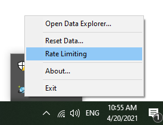

# Main branch

The following instructions are for current **main** branch only.

## Prerequisites

EF Core does not generally need any prerequisites installed to build the code. However, running tests requires certain local databases to be available:

* The SQL Server tests require a local SQL Server installation. This can be:
  * SQL Server LocalDb, usually obtained by installing the latest [Visual Studio](https://visualstudio.microsoft.com/downloads/) public preview with the "ASP.NET and web development" workload selected.
  * SQL Server [Express or Developer Edition](https://www.microsoft.com/sql-server/sql-server-downloads), on Windows or [Linux](https://learn.microsoft.com/sql/linux/sql-server-linux-setup). When not using LocalDb, make sure to set the environment variable `Test__SqlServer__DefaultConnection` to the connection string that EF Core tests should use.
* The Cosmos tests require that the [Azure Cosmos Emulator](https://docs.microsoft.com/azure/cosmos-db/local-emulator-release-notes) is installed. Use the default installation options. Make sure to start the emulator each time you restart your machine.
  * The Cosmos tests are optional and will be skipped if the emulator is not available. If you are not making Cosmos changes, then you may choose to skip installing the emulator and let the continuous integration system handle Cosmos testing.
  * Tip: Turn off "Rate Limiting" in the emulator to make the Cosmos tests run faster.<br>
    
* While not strictly necessary, since EF will download an SDK locally if needed, it is recommended to always have tha [latest public preview of the .NET SDK](https://dotnet.microsoft.com/download) installed.

## Fork the repository

If you plan to [contribute changes back to EF Core](../.github/CONTRIBUTING.md), then first [create a fork of the EFCore repo on GitHub](https://docs.github.com/en/github/getting-started-with-github/fork-a-repo).

## Clone the repository

Using your favorite [git](http://git-scm.com/) client, clone the repository. For example, to clone the main repo:

```console
git clone https://github.com/dotnet/efcore.git
```

Or if you have created a fork called `efcore` in your personal GitHub:

```console
git clone https://github.com/myusername/efcore.git
```

## Build

To build the code just call build[.cmd/.sh]. This is an **important step** since it will install a preview .NET SDK alongside EF Core. This ensures EF Core is being built with the expected SDK and msbuild version. Running `build` also restores packages and builds all projects. Tests are not run.

```console
build
```

The `build` script has different arguments to perform specific actions. The full list of arguments can be found via `build -h` command. Arguments for common actions are listed in table below. The repository root directory also contains cmd/sh files to invoke some of them directly.

| Build argument |               Action              | Script file  |
|:---------------|:----------------------------------|:-------------|
| -restore       |         Restore packages.         | restore.cmd  |
| -build         |        Build all projects.        | build.cmd    |
| -test          |  Run all tests (requires build).  | test.cmd     |
| -pack          | Build and produce NuGet packages. | None         |

## Building local packages

The `build -pack` command created all the EF Core NuGet packages and places them in `efcore\artifacts\packages`. However, these packages will have the same package version no matter how many times they are built. This confuses NuGet package caching, so if you want to build and test with local packages, then specify a new build number for each set of packages. For example:

```
build /p:OfficialBuildId=20231212.6 -pack
```

This uses the .NET convention for internal build numbers which is `yyyyMMdd.x`. Increment "x" with each build.

Using the NuGet packages build like this requires adding the package location to a local "NuGet.Config". For example:

```xml
<?xml version="1.0" encoding="utf-8"?>
<configuration>
  <packageSources>
    <add key="nuget.org" value="https://api.nuget.org/v3/index.json" protocolVersion="3" />
    <add key="Local" value="C:\local\code\efcore\artifacts\packages\Debug\Shipping" />
  </packageSources>
</configuration>
```
Place the "Nuget.Config" file in your solution or project directory.

## Using Visual Studio

**The command line `build` (see above) should be run before using the solution with Visual Studio.**

The build script installs a preview .NET Core SDK. In order to make sure Visual studio (or any other IDE) is using same SDK, certain environment variables need to be set. To configure your local environment and open solution file in Visual Studio, run following command:

```console
startvs.cmd EFCore.sln
```

You can inspect the script and use similar configuration for other IDEs.

Note that `startvs` actually opens whatever the default application is for `.sln` files. If you have multiple IDEs or multiple versions of Visual Studio installed, then make sure that the appropriate default is set, or edit the script to be explicit.

If you install the latest preview release of the [.NET SDK](https://dotnet.microsoft.com/download/dotnet), you may be able to skip using `startvs` and open the solution directly. While we strive to keep our codebase compatible with the latest preview, we may need to depend on changes that have been made since the latest preview release. If you encounter unexpected errors when opening the solution directly, try using `startvs` instead, and ensure you're on the latest preview of [Visual Studio](https://visualstudio.microsoft.com/vs/preview/).

### Run tests

Our tests are written using [xUnit.net](https://xunit.net/), and can be run with most test runners we have tried.
Tests can be run on the command line (after build) by running `test`:

```console
test
```
> Warning: Some tests may fail when the development machine is not configured for United States English by default. (That is, the current culture is not "en-US".) These failures can usually be ignored; the tests will run on the C.I. machine when the PR is submitted. See [Issue #22901: Fix tests using current culture](https://github.com/dotnet/efcore/issues/22901) for more information.

### Solving common build errors

1. Check that the package source URLs listed in the Nuget.config file in the root of the repository are accessible.
2. Clean the source directory. `git clean -xid` will clean files in the EF source directory.
3. Clear nuget packages and caches. `nuget.exe locals all -clear` will delete the NuGet caches. (You can get nuget.exe from <https://dist.nuget.org/index.html> or use `dotnet nuget`).

